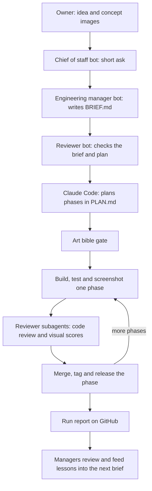

# How it works, for beginners

This guide explains how a game or a 3D asset goes from a few concept pictures to a finished release with this kit.
It covers who does what, which tools are involved, and the order things happen in. The [README](../README.md) is the
detailed reference; this page is the overview.

## 1. The big picture: a small "company"

Think of the setup as a small company with three parts:

- **Managers: Grok Bot agents.** A *bot* here is a chat agent with instructions (its "role") and a set of written
  how-tos (its "skills"). The bots plan the work, write the instructions for it, and check the results. They never
  write the code themselves.
- **The builder: Claude Code.** Claude Code is an AI coding tool that runs in a terminal. It reads the instructions,
  writes the code, runs the tests, takes screenshots, and publishes the result.
- **The shared desk: GitHub.** Everything passes through a GitHub repository (*repo*: a project folder with full
  history). The managers put a written brief there; the builder puts its code, screenshots, progress log and final
  report there. Nobody has to pass messages back and forth during a run.

A *run* is one unattended working session of Claude Code: it starts from a brief and works for minutes or hours
without anyone at the keyboard. This kit is a *template repo*: you copy it to start a new project, and it brings
the rules, checks and helper scripts that keep a long run on track.



## 2. The Grok Bot roles

Each bot has one job. The common rules for all of them:

- **Managers never edit code.** All building, fixing, installing and bulk web research goes to Claude Code. The one
  exception is a small mechanical settings change that Claude Code is not allowed to make itself (see section 3).
- **Handoffs go through files in GitHub**, not long chats. A handoff file ends with a `STATUS:` line (for example
  `STATUS: ready for review` or `STATUS: blocked, needs owner decision`) so the next bot knows at a glance where
  things stand.
- **Keep bot usage small:** one handoff out, one review back, no back-and-forth between bots during a run.

### Chief of staff
Turns the owner's idea into a short ask for the engineering manager: the goal, the approved reference images, the
decisions the owner has already made, and the budget. At the end it accepts the engineering manager's report and
passes it to the owner. It does not launch, watch or fix runs. If it has already started a step, it finishes only
that step and hands the rest over.

### Engineering manager
Owns every run from start to finish:

1. Sets up the repo from this template.
2. Writes `BRIEF.md`, the instructions for the run (outline in section 3).
3. Checks the pre-launch settings, then launches the run.
4. Watches it. Runs are unattended, so nobody approves steps along the way. If a run stalls (stops making progress),
   the engineering manager resumes it without waiting to be asked.
5. Reads the results and sends a short report: what was built, the download link, one to three screenshots, what is
   still weak, and what it cost.

Small one-off fixes also go to Claude Code, as a precise task with a check that proves it worked.

### Reviewer
Checks the brief and the plan before a run, and the finished build after it. It is *adversarial*: it assumes the
work is broken until it sees proof that it is not. It ends with a clear verdict (pass, fix needed, or block) and the
reasons. For visual work it scores the screenshots *blind*: it judges only the pictures against the art bible and
references, without reading the code or the builder's own opinion of its work. It does not supervise step by step.

### Research bot
Writes research questions and the format the answers should come back in. Claude Code does the searching and
reading; the research bot only summarises the file that comes back.

## 3. The Grok Bot skills, in plain words

A *skill* is a written how-to that a bot loads when it needs it. The managers use four.

### Claude project handoff
How to turn an ask into a run and get a result back.

- **Write the brief.** Fill in every section of `BRIEF.md`. Each "done" item must be testable by a script or by a
  screenshot score. Reference images must be committed to `docs/refs/`: an unattended run cannot see images pasted
  into a chat.
- **Pre-launch rules.** Claude Code will not edit its own settings during a run (`.claude/settings.json`, which holds
  the list of allowed commands and the hooks). So the settings, the allowed-command list, the agents and the skills
  must all be committed on the run branch before launch. Never plan a run whose first phase needs a settings change.
  Fetch and check out the run branch, and check that the branch and latest commit match, before launching. Accept
  Claude Code's folder-trust prompt once per project folder, or the project settings are ignored.
- **Avoid needless stops.** Tell the builder to use its file-editing tool rather than `sed -i`, to run one command per
  call (no edit-then-run chains), to call tools by their allow-listed names, and to keep scratch files inside the
  repo. These patterns are the most common reason a run stops to ask for permission.
- **Launch.** Send one handoff line:
  > Read BRIEF.md in `<owner>/<repo>` on branch `<run-branch>`; run it unattended per the run-protocol skill; report via run-report.json.
- **Watch.** Use one cheap background check (the kit's watcher, section 4), not frequent polling, which wastes bot
  usage.
- **Review.** Read the machine-readable files first (`run-report.json`, `run-state.json`), then `RUN-REPORT.md`, the
  screenshots and the release. Compare them with the brief's definition of done and quality bar. Put "change next
  time" items into the next brief, and into the kit itself if they apply to every project.

### Delegating to Claude Code (cloud or local)
Where to run Claude Code, in order of preference:

1. **A cloud session.** An isolated Linux machine run by Anthropic, without a GPU (graphics card). Good for work whose
   result is a branch or pull request, for tasks that can run side by side, and for risky experiments. You can follow
   it from a phone. It needs the Claude GitHub app installed on the repo.
2. **The local command line on the bot's own Linux machine** (`claude -p "<task>"`; `-p` means "run this one task
   without a chat window"). Good when the task needs files that only exist on that machine, or when the result is
   needed right away.
3. **The owner's own PC.** Only when the work truly needs it: a GPU, Windows-only tools or desktop apps.

Rules that apply everywhere:

- A task description says: the goal and why it matters, the scope (repo, branch, files, what is off limits), the
  "done" checks, the context Claude Code cannot find on its own, how much it may decide alone, and the report format.
  Claude Code has no memory of the bot's conversation.
- Ask it to end with `DONE:` and a report, or `QUESTION:` if it is stuck on a decision, plus a short JSON summary.
- Save the session id (a label for that Claude Code session); without it you cannot follow up.
- Never put secrets (passwords, API keys) in the task text. Never use `bypassPermissions` or
  `--dangerously-skip-permissions`.
- If a command is blocked, Claude Code must stop and report it, never find a way around the block.
- Treat its report as a claim: check the branch, tests and changes before telling anyone it is done.

### 3D character from concept
How to make a 3D character, creature or prop with Meshy (an online service that turns a picture into a textured 3D
model).

- **The core rule: the 3D model is only as good as the picture you feed it.** Meshy copies its input faithfully, so
  nearly all the control happens in 2D, before any paid credits are spent.
- **One full model from one image.** Make one picture of the whole character and turn it into one textured model.
  Generating separate pieces and gluing them together gave floating, untextured parts.
- **A good concept picture for 3D:** the full body head to toe, one subject, arms held away from the body (an
  "A-pose"), seen straight from the front, flat even lighting, a plain light grey background, no text or watermark.
  Make two to four versions and let the owner pick one before spending anything.
- **Add a matching back view** if possible. Side views often come out inconsistent, so check every extra view first.
- **Generate:** texturing on, PBR on (*PBR*: realistic material maps for roughness and metalness), about 30,000
  triangles for a character. A textured model costs about 30 credits. Log the balance before and after, allow at most
  one retry, and set a hard credit ceiling.
- **Check:** render the model from the front, three-quarter and back, compare it with the concept, and get the
  owner's approval.
- **Fix only what is wrong:** wrong colours mean retexturing (cheaper than rebuilding); a wrong region means editing
  the concept or fixing that part in Blender. Expect AI to get you 80 to 90% of the way.
- **Known limits:** a sheet with several angles on one image becomes stacked copies; fire, glow and transparent water
  do not come through (add them in the game engine); the back may copy details from the front.
- **For a set of assets that must share colours,** keep one master reference image and pass it into every new
  concept, and recolour the textures to the locked palette afterwards rather than paying for new ones.

### Per-asset recipes
Short step-by-step recipes for one kind of asset at a time. A recipe for water is coming soon.

### Sample BRIEF.md outline
These are the sections of the real [`BRIEF.md`](../BRIEF.md) in this repo:

```markdown
# Brief: <project>, run <run id>
## Goal                          2-3 sentences: the player's outcome, not the implementation
## Non-negotiables               owner decisions the builder must not reopen
## Definition of done            each item testable by a script or a screenshot score
## Quality bar                   numbered and measurable; reference images in docs/refs/
## Art bible and visual pipeline art bible approved, shot set, review limits, style slice, asset routes
## Scope                         must / stretch / out of scope
## Budget                        paid-service caps, wall-time ceiling, test budget
## Allowed assets and licenses   e.g. CC0 packs only; sources recorded in SOURCES.md
## Known context                 last run report, known issues to fix first
## Questions already answered    everything the builder would otherwise stop to ask
## Deliverables the bots will read run-state.json, run-report.json, RUN-REPORT.md, PROGRESS.md, release, screenshots
```

## 4. Everything else

### Claude Code
The builder. In an unattended run it reads `BRIEF.md`, writes a plan, and works through it phase by phase. It
follows the *run protocol* (`.claude/skills/run-protocol/SKILL.md`), whose first rule is "never ask, never wait":
decide, write the decision down in `PROGRESS.md`, and keep going.

### The kit (this repo)
What each part does, with the file that does it:

- **Setup.** `python3 tools/init_project.py --name "My Project" --addon godot` fills in the project name, copies the
  templates (`PLAN.md`, `PROGRESS.md`, `CLAUDE.md`) to the top folder, installs the Godot add-on and runs the
  self-test (`python tests/selftest.py`, which should print `SELFTEST OK`).
- **Phases.** The work is split into *phases* in `PLAN.md`: small steps that can each be shipped. Each phase is built,
  tested, reviewed, then *closed*: merged into the main branch, tagged (`<run>-p<N>`), and released, before the next
  one starts. `tools/review.py close P<N>` is the only thing allowed to mark a phase done.
- **Art bible gate.** The *art bible* (`ART-BIBLE.md`) is a short document of visual rules: reference images, palette,
  lighting mood, materials, size budgets, do and don't. The owner approves it by adding an `Approved:` line. No
  building starts until `python tools/art_gate.py` prints `ART GATE OK`, and the bible cannot change during a run.
- **Shot set.** A fixed list of camera positions (`docs/shots/shots.json`) rendered to images the same way every time,
  so screenshots from different rounds can be compared fairly.
- **Style slice.** Before building lots of content, the first phase builds one small scene (about 60 x 60 metres) that
  must already look right. Lighting is set first on a small patch with a few real surfaces; the main asset is
  prototyped on the side at the same time. When the slice passes, the look is *locked*: its screenshots go to
  `docs/style_reference/` and all later work must match them.
- **Look-and-fix.** Render the shots, compare them with the references, change one thing at a time, and keep the
  change only if it is clearly better.
- **Screenshot-only reviewer.** The `visual-reviewer` subagent (*subagent*: a separate Claude helper with its own
  narrow instructions, in `.claude/agents/`) acts as an art director. It sees only the screenshots, the art bible, the
  references and the scoring list, never the code. It scores every shot from 1 to 5 on eight points (silhouette,
  depth, light, palette, cohesion, secondary detail, ground, life); a shot passes at 4 or more on every point. It
  scores first and only then looks at the previous round, so old numbers do not sway it. The builder never passes its
  own work. Two more subagents review the plan (`plan-critic`) and the code (`adversarial-reviewer`).
- **Review limits that never dead-end.** Each stage gets a limited number of review rounds (3 for lighting, 6 for the
  main stage by default, in `kit.json`). If a stage uses them all without passing, the phase closes "below bar" with
  honest scores and known issues, and the run carries on. A missed bar never stops the whole run.
- **Performance gate.** A benchmark prints `BENCH avg_fps=<x> low1_fps=<y>` and `python tools/perf_gate.py --phase
  P<N> <log>` checks it against the targets in `kit.json` (by default 60 fps average, 30 fps for the slowest 1% of
  frames).
- **Hooks.** *Hooks* are small scripts Claude Code runs automatically at certain moments (`.claude/hooks/`). They keep
  the run going while phases are open (`stop_guard.py`), block risky commands such as force-pushes or deletes outside
  the project (`pre_tool_guard.py`), store the visual reviewer's verdict so the builder cannot supply it
  (`subagent_stop.py`), remind Claude Code of the rules after its memory is compacted (`session_start.py`), deny and
  log commands that are not on the allowed list (`permission_log.py`), and push a "still alive" signal to GitHub every
  10 minutes (`heartbeat.py`).
- **Paid services.** Paid services such as Meshy are only called through `python tools/paid.py`, which refuses a job
  that would go over the cap in `kit.json` and keeps a spending log.
- **Headless launch and resume.** `tools/headless/launch.sh --branch <run-branch>` starts an unattended run
  (`launch.ps1` on Windows); `tools/headless/resume.sh` continues a stalled one, stopping the old process first so two
  sessions never run at once. Details in [headless.md](headless.md).
- **Watcher.** `tools/watch/run_watch.sh --repo <owner>/<repo> --branch <run-branch>` waits until the run finishes,
  stalls or is blocked, then prints one line of JSON. That is the signal for the engineering manager to read results
  or resume the run.
- **Run report.** At the end the builder writes `run-report.json` and `RUN-REPORT.md`: what each phase achieved,
  reviews, phases below bar, spending, denied commands, known issues and "change next time".

The visual steps are explained in full in [visual-pipeline.md](visual-pipeline.md).

### Godot
Godot 4 is the free game engine the kit's add-on targets (tested on 4.7.2). Its scene (`.tscn`), script (`.gd`),
shader (`.gdshader`) and material (`.tres`) files are plain text, so Claude Code edits them directly, with no editor
window. The add-on (`addons/godot/`) adds skills for running Godot without a screen and for lighting setup, plus
scripts to render the shot set (`render_shots.gd`), render a model from four sides (`render_model.gd`) and build
contact sheets (`contact_sheet.py`: one image with all the shots side by side).

### Meshy
The picture-to-3D service from section 3. It is the only step that spends paid credits, and the only route for
characters, creatures and organic hero props. Buildings and environments are built from modular kits in Blender
instead.

### Blender cleanup
Blender is a free 3D program that can also run scripts without a window. Every generated model goes through
`tools/blender/cleanup_asset.py`:

```bash
blender -b -P tools/blender/cleanup_asset.py -- --in raw.glb --out asset.glb --height 1.8 --tris 20000 --bible ART-BIBLE.md
```

It fixes the size and pivot point, reduces the triangle count to the budget, redoes the texture layout, removes
lighting that was painted into the texture, pulls colours toward the art bible's palette, makes simpler versions for
distant views (*LODs*: levels of detail), and exports a GLB file (a common 3D file format).

### Image generation
Concept art is made with an image generator before anything is built: a hero character, a building, plants, ground,
a UI mock-up and one lighting-mood picture. The chosen images go into `docs/refs/` and become the references the
reviewer judges against. Paid image services go through `tools/paid.py` like any other.

### GitHub releases
Each closed phase is exported, zipped as `<project>-<platform>-<run>-p<N>.zip` and uploaded to a single prerelease
named `<run>-build`, so there is always a download of the latest working build.

### Where things run
- **By default, a Linux cloud machine** with no GPU. It builds, runs tests, and renders screenshots in software:
  `xvfb-run` provides a virtual screen and a software driver such as lavapipe draws in place of a graphics card. This
  is slow, and not good enough to judge final lighting.
- **A PC with a GPU** for anything that depends on real graphics: final visual review and the performance check. The
  heartbeat and the watcher let the managers follow a PC run from elsewhere through GitHub.

## 5. Order of operations

1. **Idea and concept images.** The owner describes the idea; concept images are generated and the best ones go into
   `docs/refs/`.
2. **Art bible.** In a short session (about an hour) the owner and an agent fill in `ART-BIBLE.md`, and the owner adds
   the `Approved:` line.
3. **Ask.** The chief of staff turns the idea into a short ask for the engineering manager.
4. **New repo.** The engineering manager creates the project from this template and runs `tools/init_project.py`.
5. **Brief.** The engineering manager writes `BRIEF.md`; the reviewer checks it once.
6. **Pre-launch.** Settings, allowed commands, agents and skills committed; run branch created, fetched and checked
   out; folder trust accepted; self-test OK.
7. **Launch.** The handoff line, or `tools/headless/launch.sh --branch <run-branch>`, and the watcher started.
8. **Plan.** Claude Code writes `PLAN.md`, the `plan-critic` checks it, and `tools/art_gate.py` must pass.
9. **Style slice.** Lighting first, the main asset prototyped on the side, then one real asset of each kind, until the
   visual reviewer passes it or the review limit is reached. Then the look is locked.
10. **Assets.** Characters and hero props: concept picture, Meshy, Blender cleanup, checked in the scene next to the
    other assets. Environments: modular Blender kits.
11. **Content phases.** Each one built, tested, reviewed, merged, tagged and released before the next.
12. **Stalls.** If the watcher reports a stall, the engineering manager resumes the same session with
    `tools/headless/resume.sh`.
13. **Run report and release.** Claude Code writes the report; the latest build is on the `<run>-build` release.
14. **Review.** The engineering manager and reviewer check the report, screenshots and release against the brief; the
    chief of staff passes the result to the owner.
15. **Lessons learned.** "Change next time" items go into the next brief, gotchas into `CLAUDE.md`, and general fixes
    into the kit and the bots' skills.

## 6. What you need to set this up yourself

- A **GitHub account** and the GitHub command line tool (`gh`), plus `git`.
- **Claude Code** (`claude`), signed in, or with `CLAUDE_CODE_OAUTH_TOKEN` or `ANTHROPIC_API_KEY` set for unattended
  runs.
- **Python 3.8 or newer** (the kit uses only the standard library) and **bash** (on Windows: `launch.ps1`, or Git
  Bash).
- **Godot 4** for game projects.
- Optional: **Blender** for asset cleanup, a **Meshy** account for 3D generation, and an **image generator** for
  concept art.
- A **Linux machine** for everyday runs (a cloud session or a small server), and a **PC with a GPU** for visual review
  and performance checks.
- Optional: **manager bots** (any agent setup that can write files to GitHub and run the watcher). You can also play
  the manager roles yourself: write the brief, launch, watch, and read the report.

To start, follow the Quick start in the [README](../README.md).
